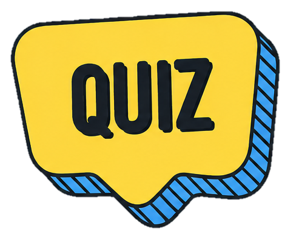
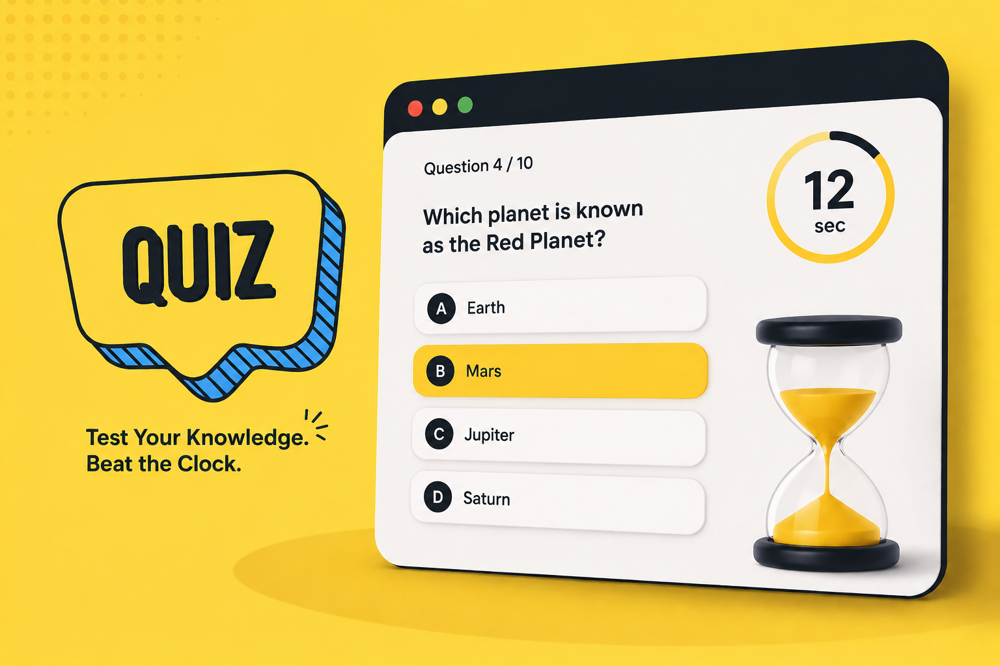

<h1>
  
  Quiz Game
</h1>

  

  A desktop quiz application built with Python and Tkinter featuring multiple categories, a countdown timer, and real-time score tracking.

  

<h2>📌 About the Project</h2>

  Quiz Game is a simple desktop application designed to test users across multiple knowledge categories through a timed quiz experience.

  Built using Python and Tkinter, the application provides an interactive interface with multiple-choice questions, a countdown timer, and score tracking throughout the game.

<h2>⚙️ Built With</h2>

  
  
  

<h2>✨ Features</h2>

<table width="100%">
  <tr>
    <th align="left">Feature</th>
    <th align="left">Description</th>
  </tr>

  <tr>
    <td>Multiple Categories</td>
    <td>Questions are organized into categories such as World Knowledge, Entertainment, Sports, and Religions.</td>
  </tr>

  <tr>
    <td>Countdown Timer</td>
    <td>Each question includes a timer to make the quiz more engaging and challenging.</td>
  </tr>

  <tr>
    <td>Score Tracking</td>
    <td>Keeps track of correct and incorrect answers throughout the game.</td>
  </tr>

  <tr>
    <td>Interactive Interface</td>
    <td>Built with Tkinter to provide a simple and responsive desktop experience.</td>
  </tr>

  <tr>
    <td>Multiple Choice Questions</td>
    <td>Allows users to select answers from predefined options.</td>
  </tr>
</table>

<h2>🎮 How It Works</h2>

<ol>
  <li>Read the question and choose one of the available options.</li>
  <li>Submit your answer before the timer expires.</li>
  <li>Receive instant score updates after each question.</li>
  <li>View your final score once all questions have been completed.</li>
</ol>

<h2>📷 Preview</h2>

  
  
  

<h2>📬 Connect With Me</h2>

  

  

  

  

 

  Thanks for checking out Quiz Game. Feedback and suggestions are always welcome.

